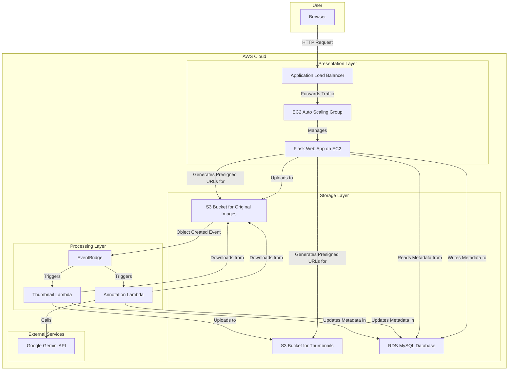

# Image Annotation System v2

This repository contains the source code, documentation, and deployment artifacts for the **Image Annotation System v2**, a cloud-native web application designed for automated image processing and annotation. The system leverages a serverless, event-driven architecture on AWS to provide a scalable, resilient, and efficient solution.

## Architecture Overview

The system is built on a modern, three-tier cloud architecture that separates concerns between the user-facing web application, durable storage, and asynchronous backend processing.



**Workflow:**
1.  A user uploads an image via the **Flask Web App**.
2.  The web app stores the original image in an **S3 Bucket** and records its initial metadata in the **RDS MySQL Database**.
3.  The S3 upload triggers an `ObjectCreated` event, which is routed by **EventBridge** to two AWS Lambda functions.
4.  The **Annotation Lambda** calls the **Google Gemini API** to generate a descriptive caption for the image.
5.  The **Thumbnail Lambda** creates a fixed-size thumbnail of the image.
6.  Both Lambda functions update the image's record in the **RDS Database** with the results (caption, thumbnail location) and status (`completed` or `failed`).
7.  The web app's gallery dynamically displays the images, their annotations, and thumbnails by generating secure, temporary URLs (presigned URLs) for the content in S3.

## Key Features

-   **Asynchronous Processing**: Image captioning and thumbnailing are handled in the background without blocking the user interface.
-   **Scalable Web Tier**: The web application is hosted on an EC2 Auto Scaling Group behind an Application Load Balancer, allowing it to handle variable traffic loads.
-   **Serverless Backend**: AWS Lambda functions provide a cost-effective, scalable, and maintenance-free solution for image processing.
-   **AI-Powered Annotation**: Integrates with Google's Gemini API to provide intelligent, context-aware descriptions for images.
-   **Secure and Durable Storage**: Uses AWS S3 for image storage and RDS for structured metadata, ensuring data integrity and availability.
-   **Infrastructure as Code (IaC)**: The entire cloud infrastructure is defined and managed using AWS CloudFormation templates for consistency and repeatability.
-   **Load Testing**: Includes a script to simulate user traffic and test the performance and scalability of the application.

## Tech Stack

-   **Cloud Provider**: AWS
-   **Backend**: Python 3.9, Flask, Gunicorn
-   **Serverless**: AWS Lambda, AWS EventBridge
-   **Database**: AWS RDS (MySQL)
-   **Storage**: AWS S3
-   **Networking**: AWS VPC, Application Load Balancer
-   **Compute**: AWS EC2 Auto Scaling Group
-   **AI Service**: Google Gemini API
-   **Testing**: Pytest, Pytest-Mock
-   **IaC**: AWS CloudFormation

## Project Structure

```
.
├── image_annotation_system_v2/ # Main application source code
│   ├── web_app/                # Flask web application
│   ├── lambda_functions/       # Serverless backend functions
│   ├── deployment/             # AWS CloudFormation templates
│   ├── database/               # Database schema
│   └── tests/                  # Unit tests
├── Project_Design.md           # Detailed technical design document
├── API_DOCUMENTATION.md        # API endpoint documentation
└── load_tester.py              # Script for load testing the application
```

## Getting Started

For detailed instructions on local setup, please refer to the [README inside the `image_annotation_system_v2` directory](image_annotation_system_v2/README.md).

### Prerequisites

-   Python 3.9
-   Docker
-   AWS CLI
-   An active AWS account and a Google Cloud project with the Gemini API enabled.

## Deployment

The entire infrastructure is deployed using the AWS CloudFormation templates located in the `image_annotation_system_v2/deployment/` directory.

The deployment is modular and consists of several stacks that must be deployed in order:
1.  `00-ecr-repositories.yaml`: Creates ECR repositories for Docker images.
2.  `01-vpc-network.yaml`: Sets up the VPC and networking infrastructure.
3.  `02-application-stack.yaml`: Provisions S3 buckets and the RDS database.
4.  `03-lambda-stack.yaml`: Deploys the Lambda functions and their triggers.
5.  `04-ec2-alb-asg-stack.yaml`: Deploys the EC2 Auto Scaling Group and Application Load Balancer for the web app.

Before deploying the Lambda and EC2 stacks, the corresponding Docker images must be built and pushed to the ECR repositories created in the first step.

For more details, see the [deployment README](image_annotation_system_v2/deployment/README.md).

## Load Testing

This project includes a simple Python script to load test the application's gallery endpoint.

**Usage:**
```bash
python load_tester.py --url <your_alb_dns_url>/gallery --num-requests 1000 --concurrency 10
```

**Arguments:**
-   `--url`: The full URL of the endpoint to test.
-   `--num-requests` (or `-n`): Total number of requests to send. Default: `1000`.
-   `--concurrency` (or `-c`): Number of concurrent threads (simulated users). Default: `10`.

## API Documentation

The web application exposes a RESTful API endpoint for checking the status of image processing tasks. For detailed information, please see the [API_DOCUMENTATION.md](API_DOCUMENTATION.md) file.
