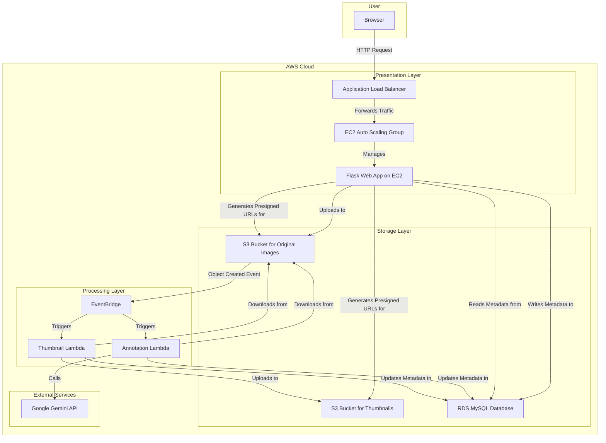

# Image Annotation System v2

This COMP5349 course project contains the source, documentation, and deployment artifacts for **Image Annotation System v2**, an AWS application for image uploads, Gemini-generated captions, and thumbnails.

The deployment and load-test records in [Report/report.md](Report/report.md) describe historical course work. They do not establish that the AWS resources or endpoints are currently running. AI-assisted maintenance currently covers documentation and source checks; no cloud deployment or load test was performed for this update.

## Architecture Overview

The source and CloudFormation templates define a three-tier architecture that separates concerns between the user-facing web application, durable storage, and asynchronous backend processing.


```mermaid
graph TD
    subgraph "User"
        A[Browser]
    end

    subgraph "AWS Cloud"
        subgraph "Presentation Layer"
            B[Application Load Balancer]
            C[EC2 Auto Scaling Group]
            D[Flask Web App on EC2]
        end

        subgraph "Storage Layer"
            E[S3 Bucket for Original Images]
            F[S3 Bucket for Thumbnails]
            G[RDS MySQL Database]
        end

        subgraph "Processing Layer"
            H[EventBridge]
            I[Annotation Lambda]
            J[Thumbnail Lambda]
        end

        subgraph "External Services"
            K[Google Gemini API]
        end
    end

    A -- HTTP Request --> B
    B -- Forwards Traffic --> C
    C -- Manages --> D
    D -- Uploads to --> E
    D -- Writes Metadata to --> G
    D -- Reads Metadata from --> G
    D -- Generates Presigned URLs for --> E
    D -- Generates Presigned URLs for --> F

    E -- Object Created Event --> H

    H -- Triggers --> I
    H -- Triggers --> J

    I -- Downloads from --> E
    I -- Calls --> K
    I -- Updates Metadata in --> G

    J -- Downloads from --> E
    J -- Uploads to --> F
    J -- Updates Metadata in --> G
```

**Workflow:**
1.  A user uploads an image via the **Flask Web App**.
2.  The web app stores the original image in an **S3 Bucket** and records its initial metadata in the **RDS MySQL Database**.
3.  The S3 upload triggers an `ObjectCreated` event, which is routed by **EventBridge** to two AWS Lambda functions.
4.  The **Annotation Lambda** calls the **Google Gemini API** to generate a descriptive caption for the image.
5.  The **Thumbnail Lambda** creates a fixed-size thumbnail of the image.
6.  Both Lambda functions update the image's record in the **RDS Database** with the results (caption, thumbnail location) and status (`completed` or `failed`).
7.  The web app's gallery dynamically displays the images, their annotations, and thumbnails by generating temporary presigned URLs for the content in S3.

## Key Features

-   **Asynchronous Processing**: Separate Lambda functions handle captioning and thumbnail generation after image upload.
-   **Web Tier**: CloudFormation templates define an EC2 Auto Scaling Group and Application Load Balancer for the Flask web app.
-   **Lambda Backend**: Includes separate annotation and thumbnail functions, container definitions, and packaging scripts.
-   **Image Annotation**: The annotation function calls Google's Gemini API for image captions.
-   **Storage**: Uses S3 for images and RDS/MySQL for image metadata.
-   **Infrastructure as Code**: Includes five CloudFormation templates for repositories, networking, application resources, Lambda, and the web tier.
-   **Load-Test Script**: Includes a script for sending concurrent requests to the gallery endpoint; historical observations are retained in the course report.

## Tech Stack

-   **Cloud Provider**: AWS
-   **Backend**: Python 3.9, Flask, Gunicorn
-   **Serverless**: AWS Lambda, AWS EventBridge
-   **Database**: AWS RDS (MySQL)
-   **Storage**: AWS S3
-   **Networking**: AWS VPC, Application Load Balancer
-   **Compute**: AWS EC2 Auto Scaling Group
-   **AI Service**: Google Gemini API
-   **Testing**: Pytest, Pytest-Mock
-   **IaC**: AWS CloudFormation

## Project Structure

```
.
├── image_annotation_system_v2/ # Main application source code
│   ├── web_app/                # Flask web application
│   ├── lambda_functions/       # Serverless backend functions
│   ├── deployment/             # AWS CloudFormation templates
│   ├── database/               # Database schema
│   └── tests/                  # Unit tests
├── Project_Design.md           # Detailed technical design document
├── API_DOCUMENTATION.md        # API endpoint documentation
└── load_tester.py              # Script for load testing the application
```

## Getting Started

For detailed instructions on local setup, please refer to the [README inside the `image_annotation_system_v2` directory](image_annotation_system_v2/README.md).

### Prerequisites

-   Python 3.9
-   Docker
-   AWS CLI
-   An active AWS account and a Google Cloud project with the Gemini API enabled.

## Deployment

The historical deployment procedure uses the AWS CloudFormation templates in `image_annotation_system_v2/deployment/`. Review account configuration, service requirements, and the Gemini SDK/model settings before attempting a new deployment; the current AWS environment has not been checked.

The documented stack order is:
1.  `00-ecr-repositories.yaml`: Creates ECR repositories for Docker images.
2.  `01-vpc-network.yaml`: Sets up the VPC and networking infrastructure.
3.  `02-application-stack.yaml`: Provisions S3 buckets and the RDS database.
4.  `03-lambda-stack.yaml`: Deploys the Lambda functions and their triggers.
5.  `04-ec2-alb-asg-stack.yaml`: Deploys the EC2 Auto Scaling Group and Application Load Balancer for the web app.

Before deploying the Lambda and EC2 stacks, the corresponding Docker images must be built and pushed to the ECR repositories created in the first step.

For more details, see the [deployment README](image_annotation_system_v2/deployment/README.md).

## Load Testing

This project includes a simple Python script to load test the application's gallery endpoint.

**Usage:**
```bash
python load_tester.py --url <your_alb_dns_url>/gallery --num-requests 1000 --concurrency 10
```

**Arguments:**
-   `--url`: The full URL of the endpoint to test.
-   `--num-requests` (or `-n`): Total number of requests to send. Default: `1000`.
-   `--concurrency` (or `-c`): Number of concurrent threads (simulated users). Default: `10`.

## API Documentation

The web application exposes a RESTful API endpoint for checking the status of image processing tasks. For detailed information, please see the [API_DOCUMENTATION.md](API_DOCUMENTATION.md) file.
