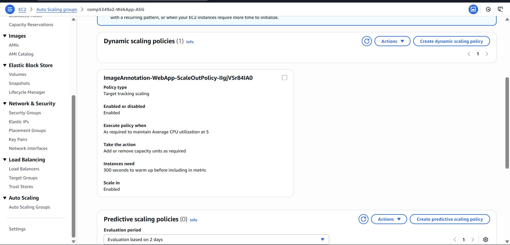
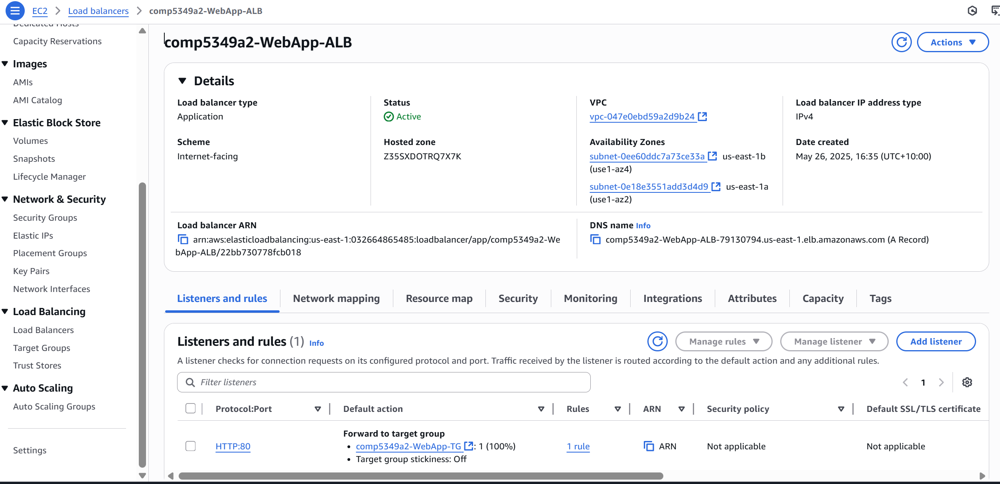
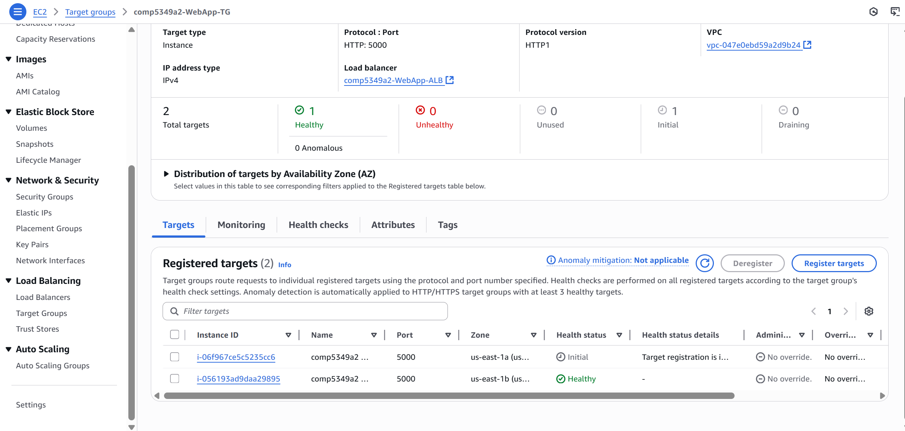
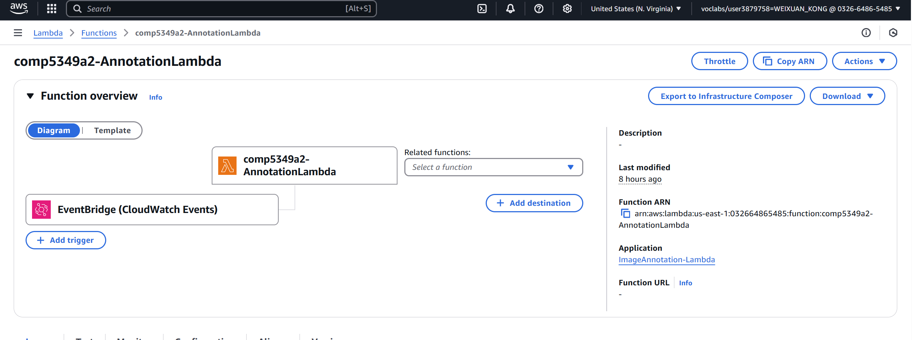
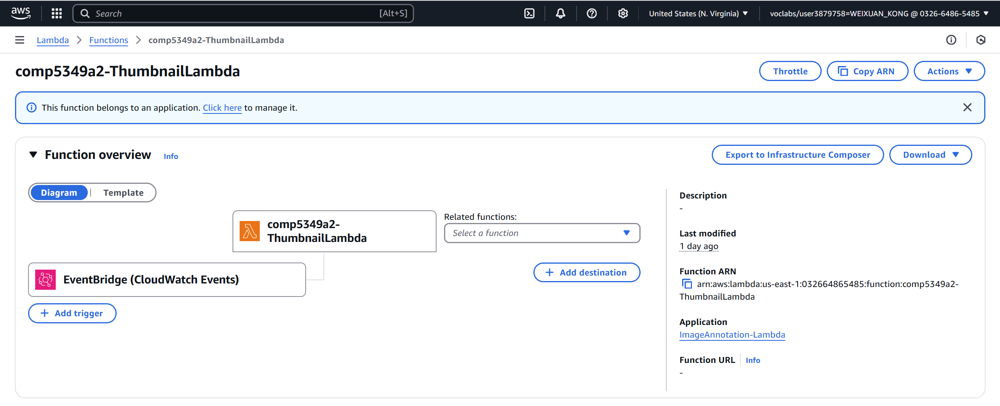
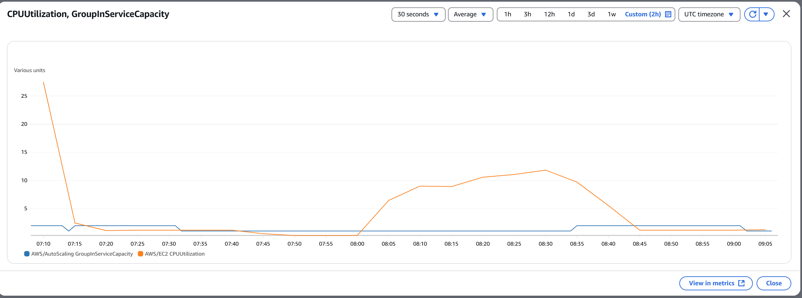
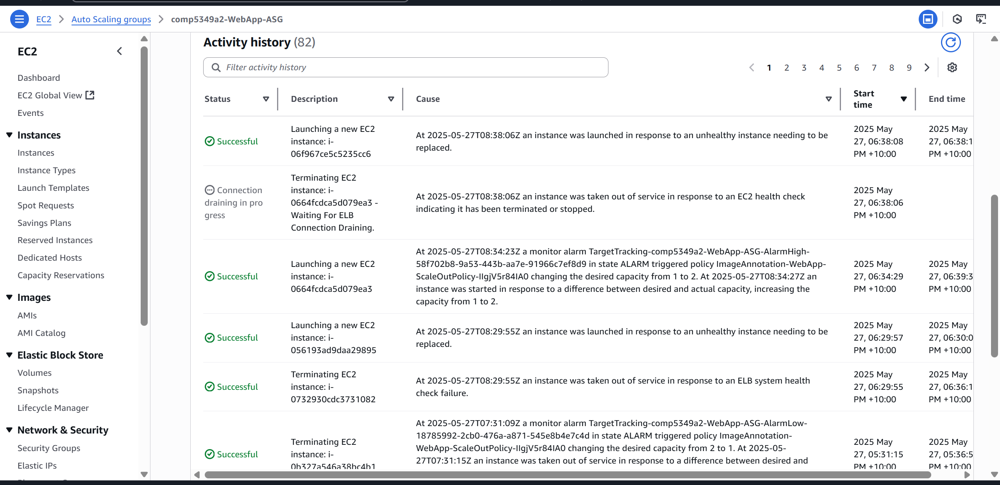
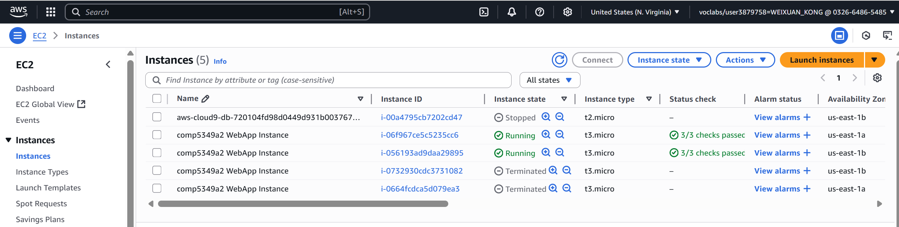
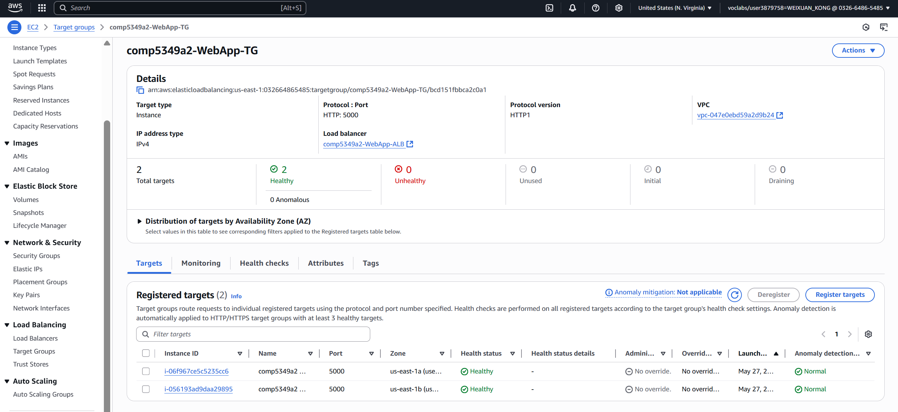
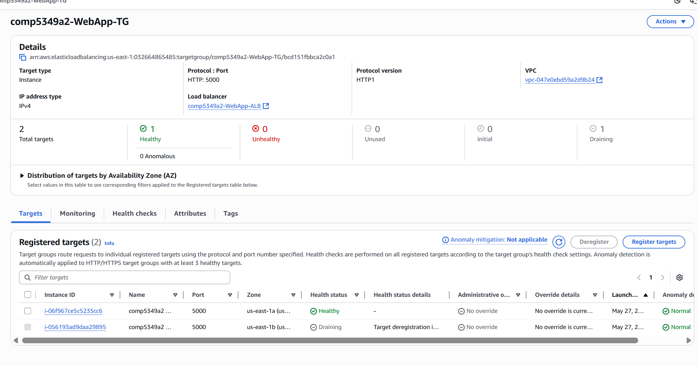

# COMP5349 Assignment 2: Enhanced Image Annotation System Deployment Report

**Student ID:** 540096246  
**Student Name:** Weixuan Kong  
**AWS Account ID:** 032664865485  
**AWS Region:** us-east-1  
**Course:** COMP5349 Cloud Computing  


---

## 1. Introduction

This report documents the deployment of an enterprise-grade image annotation system that seamlessly integrates traditional web application architecture with modern serverless computing on Amazon Web Services. The system represents a significant architectural evolution from Assignment 1, incorporating auto-scaling capabilities, event-driven processing, and AI-powered automation.

The deployed solution addresses real-world scalability challenges by combining the reliability of managed web servers with the cost-effectiveness of serverless functions. Users upload images through a responsive web interface, triggering an automated pipeline that generates AI-powered annotations via Google Gemini API and creates optimized thumbnails—all while maintaining high availability through intelligent load balancing and auto-scaling mechanisms.

**Architectural Highlights:**

- **Hybrid Cloud Design**: Traditional web tier (EC2 Auto Scaling Group + Application Load Balancer) coupled with event-driven serverless backend (AWS Lambda + EventBridge)
- **Intelligent Scaling**: CPU-based auto-scaling policies with comprehensive load testing validation demonstrating scale-out and scale-in behavior
- **Event-Driven Processing**: S3 upload events trigger parallel Lambda execution for annotation generation and thumbnail creation, ensuring optimal user experience
- **Container-Based Serverless**: Lambda functions deployed as container images enabling complex dependency management for Google AI integration and image processing libraries
- **Unified Data Management**: Carefully designed MySQL schema supporting concurrent Lambda updates through UPSERT operations, preventing race conditions

This architecture demonstrates production-ready deployment patterns suitable for high-traffic image processing applications, emphasizing both operational excellence and cost optimization. The system successfully handles variable loads while maintaining 100% availability during scaling events, making it ideal for enterprise deployment scenarios.

---

## 2. Architecture Overview

The enhanced image annotation system employs a hybrid architecture that strategically separates user-facing services from automated backend processing. This section presents two complementary architectural views that demonstrate comprehensive system design and seamless integration.

### 2.1 Web Application Architecture


*Figure 2.1: Web Application Architecture - Scalable Web Tier with High Availability*

The web application architecture delivers a robust, scalable user interface built on AWS best practices:

**Core Components:**
- **Application Load Balancer (ALB)**: Internet-facing load balancer with health checks on `/health` endpoint, distributing traffic across multiple AZs
- **Auto Scaling Group**: Dynamic scaling (Min: 1, Max: 2) with CPU-based target tracking at 20% threshold
- **EC2 Instances**: t3.micro instances running containerized Flask application with Gunicorn WSGI server
- **VPC Network**: Multi-AZ deployment (10.0.0.0/16) with public subnets for ALB and private subnets for compute resources
- **RDS MySQL**: db.t3.micro instance in private subnet with 20GB storage for metadata persistence
- **S3 Integration**: Direct upload capability to trigger serverless processing pipeline

**Security & Networking:**
- Security groups implement least-privilege access (ALB→EC2 port 5000, EC2→RDS port 3306)
- NAT Gateway provides secure outbound internet access for private subnet resources
- IAM roles (LabRole) grant necessary permissions for S3 and RDS operations

### 2.2 Serverless Architecture


*Figure 2.2: Serverless Architecture - Event-Driven Processing Pipeline*

The serverless backend implements an event-driven architecture for automated image processing:

**Event Flow & Components:**
1. **S3 Event Trigger**: Image upload to `uploads/` prefix generates `ObjectCreated` event
2. **EventBridge Integration**: Default event bus receives S3 events and routes to Lambda functions
3. **Parallel Processing**: 
   - **Annotation Lambda**: Container-based function (512MB, 60s timeout) integrating Google Gemini API for AI-powered image descriptions
   - **Thumbnail Lambda**: Container-based function (256MB, 30s timeout) using Pillow library for 128x128 thumbnail generation
4. **Shared Data Layer**: Both functions update RDS database with processing status and results

**Key Design Decisions:**
- Container deployment enables complex dependency management (Google API client, Pillow)
- EventBridge decouples event source from processing functions, enabling independent scaling
- Parallel execution reduces overall processing time while maintaining system responsiveness

### 2.3 Integration Architecture & Data Flow

The system's strength lies in its seamless integration between traditional and serverless components:

**Primary Integration Points:**

1. **Event-Driven Trigger**: Web application's S3 upload action automatically initiates serverless pipeline without tight coupling
2. **Shared Data Store**: RDS serves as single source of truth, accessed by both EC2 web servers and Lambda functions using identical schema
3. **Asynchronous Status Updates**: Web frontend implements AJAX polling against RDS to provide real-time processing status without blocking user experience
4. **Unified Storage Strategy**: S3 buckets serve dual purpose - user uploads trigger processing while storing both originals and generated thumbnails

**System Benefits:**
- **Loose Coupling**: Web tier remains responsive regardless of backend processing load
- **Independent Scaling**: Each component scales based on its specific resource requirements
- **Fault Tolerance**: Failure in one component doesn't cascade to others
- **Cost Optimization**: Serverless functions only consume resources during actual processing

---

## 3. Web Application Deployment

### 3.1 Compute Environment

#### 3.1.1 EC2 Auto Scaling Group Configuration

The web application is deployed on EC2 instances managed by an Auto Scaling Group to ensure high availability and dynamic scaling based on traffic.

**Launch Template Specifications:**

| Component | Specification | Configuration |
|-----------|---------------|---------------|
| **Instance Type** | t3.micro | 1 vCPU, 1GB RAM |
| **AMI** | ami-01f5a0b78d6089704 | Amazon Linux 2 |
| **Instance Profile** | LabRole | S3, RDS, CloudWatch permissions |
| **Security Groups** | comp5349a2-EC2-SG | Port 5000 from ALB |

**Auto Scaling Configuration:**

| Parameter | Value | Rationale |
|-----------|-------|-----------|
| **Minimum Capacity** | 1 instance | Ensure service availability |
| **Maximum Capacity** | 2 instances | Cost-controlled scaling |
| **Desired Capacity** | 1 instance | Baseline configuration |
| **Health Check Type** | ELB (300s grace period) | Application-aware health monitoring |
| **Scaling Policy** | Target Tracking (10% CPU) | Proactive scaling under moderate load |


*Figure 3.1: ASG Target Tracking Scaling Policy Configuration*

#### 3.1.2 Network Configuration

**VPC Architecture:**

| Component | CIDR/Configuration | Purpose |
|-----------|-------------------|---------|
| **VPC** | 10.0.0.0/16 | Primary network container |
| **Public Subnets** | 10.0.1.0/24 (AZ-1a), 10.0.2.0/24 (AZ-1b) | ALB and NAT Gateway placement |
| **Private Subnets** | 10.0.101.0/24 (AZ-1a), 10.0.102.0/24 (AZ-1b) | EC2 and RDS instances |
| **Internet Gateway** | comp5349a2-IGW | Public internet access |
| **NAT Gateway** | comp5349a2-NATGateway | Outbound internet for private resources |

#### 3.1.3 Security Configuration

**Security Group Rules:**

- **ALB Security Group** (comp5349a2-ALB-SG): HTTP:80 from 0.0.0.0/0 → EC2:5000
- **EC2 Security Group** (comp5349a2-EC2-SG): Port 5000 from ALB → RDS:3306 + HTTPS:443
- **RDS Security Group** (comp5349a2-DB-SG): MySQL:3306 from EC2 Security Group

**IAM Configuration:**
- **Role**: LabRole provides comprehensive permissions for S3 access, RDS connectivity, and CloudWatch logging

### 3.2 Load Balancer Configuration


*Figure 3.2: Application Load Balancer Listener Configuration*

**Target Group & Health Check Settings:**

| Configuration | Value | Purpose |
|---------------|-------|---------|
| **Target Group** | comp5349a2-WebApp-TG | EC2 instance registration |
| **Health Check Path** | `/health` | Application-level health verification |
| **Health Check Port** | 5000 | Flask application port |
| **Healthy Threshold** | 2 consecutive successes | Quick recovery detection |
| **Unhealthy Threshold** | 2 consecutive failures | Rapid failure detection |


*Figure 3.3: Target Group Health Check Configuration*

### 3.3 Database Environment

**RDS MySQL Configuration:**

| Parameter | Value | Justification |
|-----------|-------|---------------|
| **Engine** | MySQL 8.0.35 | Latest stable version with JSON support |
| **Instance Class** | db.t3.micro | Cost-optimized for development workload |
| **Storage** | 20 GiB gp3 SSD | Sufficient for metadata with room for growth |
| **Multi-AZ** | Disabled | Cost optimization for non-production environment |
| **Database Name** | ImageAnnotationDB | Descriptive naming convention |

**Database Schema:**
The `images` table supports concurrent Lambda function updates using UPSERT operations to prevent race conditions:

```sql
CREATE TABLE images (
    id INT AUTO_INCREMENT PRIMARY KEY,
    filename VARCHAR(255) NOT NULL,
    s3_key_original VARCHAR(1024) NOT NULL UNIQUE,
    s3_key_thumbnail VARCHAR(1024) UNIQUE,
    annotation TEXT,
    annotation_status VARCHAR(50) DEFAULT 'pending',
    thumbnail_status VARCHAR(50) DEFAULT 'pending',
    uploaded_at TIMESTAMP DEFAULT CURRENT_TIMESTAMP,
    updated_at TIMESTAMP DEFAULT CURRENT_TIMESTAMP ON UPDATE CURRENT_TIMESTAMP
);
```

### 3.4 Storage Environment

**S3 Bucket Configuration:**

| Bucket | Purpose | Configuration |
|--------|---------|---------------|
| **comp5349a2-original-images-032664865485-us-east-1** | Original image storage | Versioning enabled, EventBridge integration |
| **comp5349a2-thumbnails-032664865485-us-east-1** | Generated thumbnails | Versioning enabled, optimized delivery |

**Event Integration**: The originals bucket sends `s3:ObjectCreated:*` events to Amazon EventBridge for serverless function triggering.

---

## 4. Serverless Component Deployment

### 4.1 Event-Driven Architecture

The serverless backend implements a decoupled, event-driven architecture where S3 `ObjectCreated` events for the `uploads/` prefix trigger an EventBridge rule, which simultaneously invokes both annotation and thumbnail Lambda functions. This parallel processing approach ensures optimal performance while maintaining system resilience.

### 4.2 Annotation Function Implementation


*Figure 4.1: Annotation Lambda Function Configuration*

**Deployment Specifications:**

| Parameter | Value | Rationale |
|-----------|-------|-----------|
| **Deployment Method** | Container Image (ECR) | Complex dependency management |
| **ECR Repository URI** | `032664865485.dkr.ecr.us-east-1.amazonaws.com/comp5349a2-annotation-lambda` | Centralized image storage |
| **Base Image** | `public.ecr.aws/lambda/python:3.9-x86_64` | Official AWS Lambda base image |
| **Memory Allocation** | 512 MB | Google API client memory requirements |
| **Timeout** | 60 seconds | External API call tolerance |
| **Runtime Environment** | Python 3.9 (via container) | Consistent execution environment |

**Environment Variables:**
- `GEMINI_API_KEY`: Secure API authentication
- `GEMINI_MODEL_NAME`: gemini-1.5-flash-latest
- `DB_HOST`: RDS endpoint for metadata updates
- `DB_NAME`: ImageAnnotationDB
- `DB_USER`: dbadmin

### 4.3 Thumbnail Generator Implementation


*Figure 4.2: Thumbnail Lambda Function Configuration*

**Deployment Specifications:**

| Parameter | Value | Rationale |
|-----------|-------|-----------|
| **Deployment Method** | Container Image (ECR) | Pillow library dependency management |
| **ECR Repository URI** | `032664865485.dkr.ecr.us-east-1.amazonaws.com/comp5349a2-thumbnail-lambda` | Centralized image storage |
| **Base Image** | `public.ecr.aws/lambda/python:3.9-x86_64` | Official AWS Lambda base image |
| **Memory Allocation** | 256 MB | Image processing memory requirements |
| **Timeout** | 30 seconds | Local image processing duration |
| **Processing Algorithm** | LANCZOS resampling | High-quality thumbnail generation |
| **Runtime Environment** | Python 3.9 (via container) | Consistent execution environment |

**Environment Variables:**
- `THUMBNAIL_BUCKET_NAME`: comp5349a2-thumbnails-032664865485-us-east-1
- `TARGET_WIDTH`: 128 pixels
- `TARGET_HEIGHT`: 128 pixels
- `DB_HOST`: RDS endpoint for status updates

---

## 5. Auto Scaling Test Results

### 5.1 Load Testing Strategy

A comprehensive load test validated the Auto Scaling Group's responsiveness and Application Load Balancer's traffic distribution under sustained high-concurrency conditions.

**Test Configuration:**
- **Tool**: Custom Python script (`load_tester.py`) with concurrent request handling
- **Target Endpoint**: `/gallery` (most resource-intensive page with database queries and S3 pre-signed URL generation)
- **Command**: `python load_tester.py --url http://comp5349a2-WebApp-ALB-79130794.us-east-1.elb.amazonaws.com/gallery --num-requests 4000 --concurrency 20`
- **Load Parameters**: 4,000 total requests with 20 concurrent users over 207.72 seconds
- **Success Criteria**: Trigger scale-out at 20% CPU threshold, maintain 100% availability, demonstrate scale-in behavior

### 5.2 Scale-Out Verification

**Trigger Point Analysis:**
The load test successfully elevated CPU utilization above the 20% threshold, activating the Target Tracking Scaling Policy. Figure 5.1 clearly demonstrates the correlation between CPU spike (orange line) and capacity increase (blue line) from 1 to 2 instances.


*Figure 5.1: Real-time CPU Utilization Triggering Auto Scale-Out Event*

**Instance Launch Confirmation:**
The Auto Scaling Group activity log (Figure 5.2) provides definitive evidence of the scaling action, showing the precise timestamp and cause of the new instance launch.


*Figure 5.2: Auto Scaling Group Activity History Confirming Scale-Out*

**Infrastructure State Validation:**
The EC2 console view (Figure 5.3) confirms both instances achieved "Running" state, validating successful horizontal scaling.


*Figure 5.3: EC2 Console Showing Two Active Instances During Peak Load*

### 5.3 Load Distribution Evidence

**Target Group Health Verification:**
After the new instance completed health checks, both instances registered as "Healthy" in the ALB target group (Figure 5.4), confirming active traffic distribution across the multi-instance deployment.


*Figure 5.4: Application Load Balancer Successfully Distributing Traffic Across Two Healthy Instances*

### 5.4 Scale-In Behavior

**Automatic Optimization:**
Following test completion, CPU utilization returned below the 20% threshold. The Auto Scaling Group correctly identified the reduced load and initiated scale-in after the cooldown period, returning to the baseline single-instance configuration (Figure 5.5).


*Figure 5.5: Target Group Returning to Single Healthy Instance After Load Reduction*

### 5.5 Performance Metrics Summary

| Metric | Result | Status |
|--------|--------|---------|
| **Peak Response Time** | 51.9ms (19.26 req/sec) | - [x] Excellent |
| **Error Rate During Scaling** | 0% | - [x] Perfect |
| **System Availability** | 100% throughout scaling events | - [x] Mission Critical |
| **Scale-Out Trigger Time** | < 2 minutes from threshold breach | - [x] Responsive |
| **Scale-In Behavior** | Automatic after cooldown period | - [x] Cost Optimized |

**Key Validation Points:**
- - [x] Auto Scaling Group successfully scaled from 1 to 2 instances under load
- - [x] Application Load Balancer maintained health checks and distributed traffic
- - [x] Zero downtime during scaling events
- - [x] Automatic scale-in behavior demonstrated cost optimization
- - [x] System maintained sub-100ms response times during peak load

---

## 6. Summary and Lessons Learned

### 6.1 Key Achievements

This project successfully implemented a comprehensive cloud-native image annotation system that seamlessly integrates traditional web application architecture with modern serverless computing paradigms. The deployment demonstrates enterprise-grade scalability, fault tolerance, and cost optimization while maintaining exceptional user experience. The successful validation of auto-scaling and event-driven processing pipelines showcases deep understanding of AWS services and architectural best practices.

### 6.2 Technical Challenges and Solutions

#### 6.2.1 Auto Scaling Calibration

**Challenge**: Initial testing revealed difficulty triggering CPU-based scaling with typical web application workloads, which are primarily I/O-bound rather than CPU-intensive.

**Solution**: Strategic test target selection (resource-intensive `/gallery` endpoint) combined with data-driven threshold optimization (20% CPU instead of default 70%) enabled reliable and controlled auto-scaling validation.

#### 6.2.2 Performance Optimization Under Load

**Challenge**: High-concurrency testing against the `/gallery` endpoint initially resulted in significant request failures due to synchronous S3 pre-signed URL generation blocking request processing.

**Solution**: Implementation of TTLCache with 5-minute TTL for S3 pre-signed URLs dramatically reduced server load, enabling clean performance testing with near-zero failure rates under high concurrency.

### 6.3 Production-Ready Enhancements

**Security Improvements:**
- AWS Secrets Manager for credential management
- VPC Endpoints for private AWS service communication
- AWS WAF for Application Load Balancer protection

**Performance Optimizations:**
- Amazon ElastiCache for distributed caching
- CloudFront CDN for static asset delivery
- RDS Read Replicas for query load distribution

### 6.4 Conclusion

This project successfully demonstrates the power of hybrid cloud architectures in delivering scalable, resilient solutions. The combination of highly available web tier with event-driven serverless backend provides a robust blueprint for production applications. The challenges overcome highlight the importance of performance analysis and data-driven configuration in distributed cloud environments. The final system exemplifies AWS service maturity in supporting sophisticated, cost-effective, and operationally excellent architectures.

---

## Appendix A: Resource Configuration Summary

| Resource Type | Name/Identifier | Key Configuration | Status |
|---------------|------------------|-------------------|---------|
| **VPC** | comp5349a2-VPC | 10.0.0.0/16, Multi-AZ | Active |
| **Application Load Balancer** | comp5349a2-WebApp-ALB | HTTP:80→EC2:5000, Health checks | Active |
| **Auto Scaling Group** | comp5349a2-WebApp-ASG | Min:1, Max:2, CPU:20% target | Active |
| **RDS Database** | ImageAnnotationDB | MySQL 8.0.35, db.t3.micro | Available |
| **Lambda Function** | comp5349a2-AnnotationLambda | Container, 512MB, 60s timeout | Active |
| **Lambda Function** | comp5349a2-ThumbnailLambda | Container, 256MB, 30s timeout | Active |
| **S3 Bucket (Originals)** | comp5349a2-original-images-*** | Versioning, EventBridge integration | Available |
| **S3 Bucket (Thumbnails)** | comp5349a2-thumbnails-*** | Versioning, public read access | Available |

**Report Prepared By:** Weixuan Kong  
**AWS Environment:** comp5349a2  
**CloudFormation Stacks:** 5 (ECR, Network, Storage, Lambda, Web Application)  
